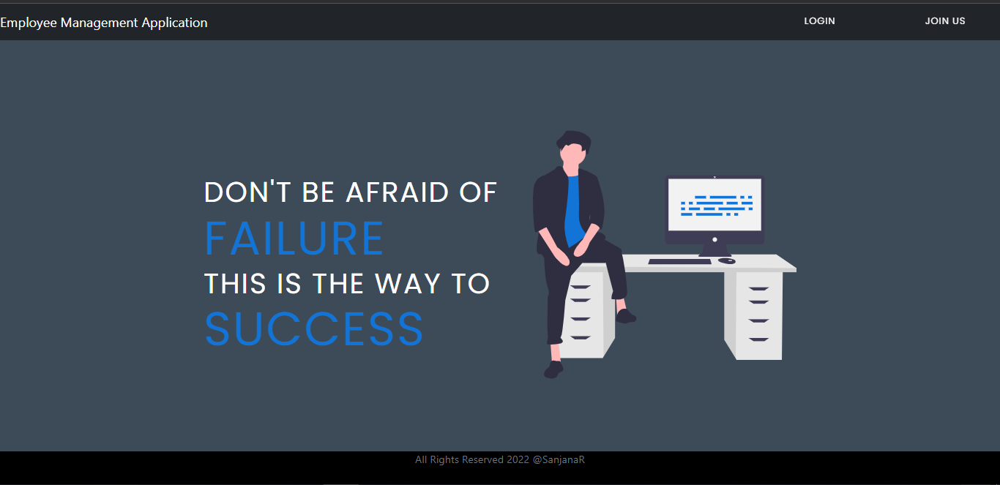
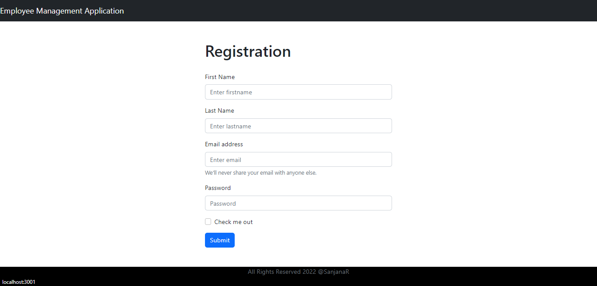
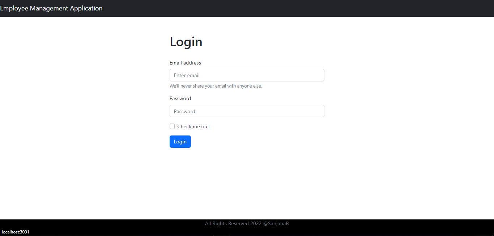
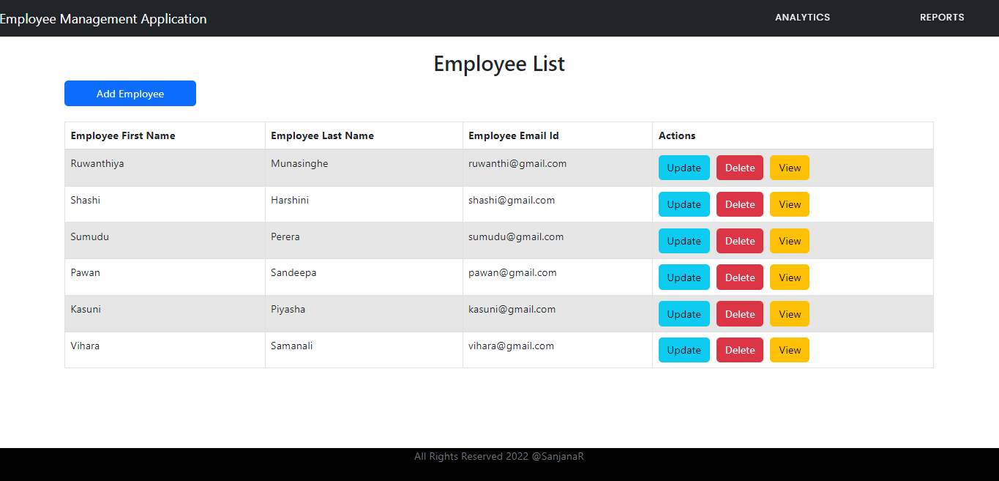
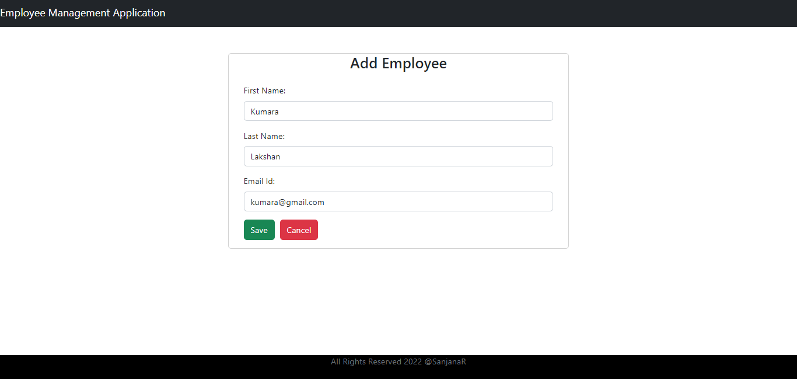
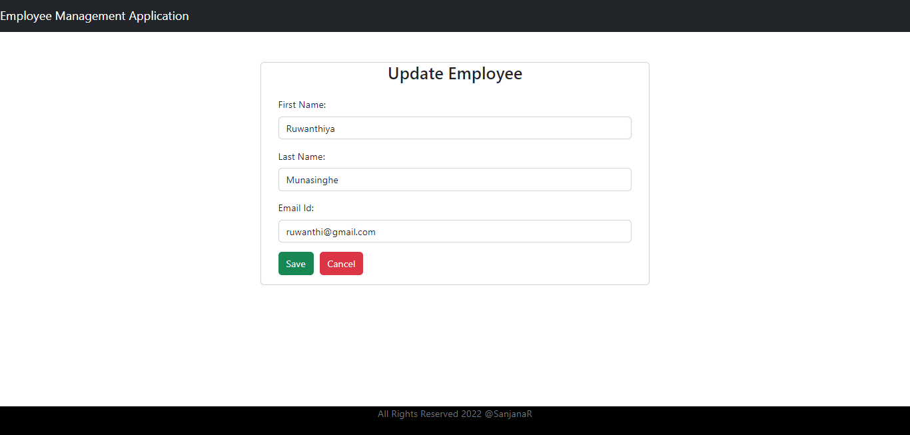
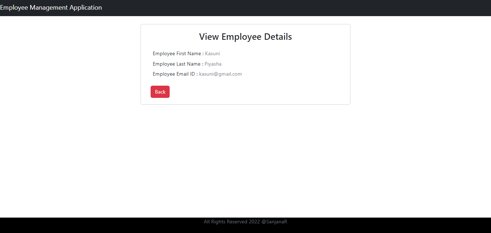
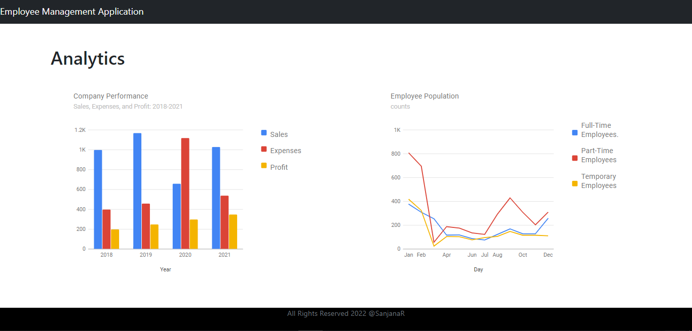
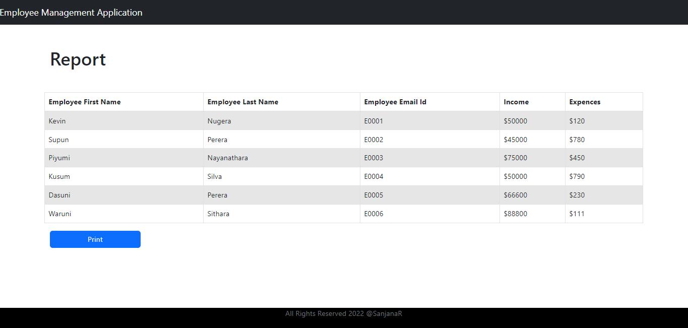

# React_Springboot_Employee_Management_System

This is an Employee Management System which provide facilities to add, update, delete and view employees. And also there are navigations for report view and analytics view.

## Screen Captures

